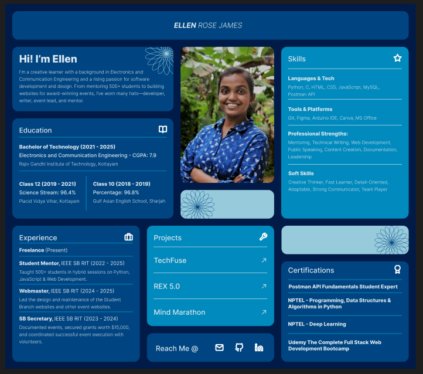

# Portfolio

A personal portfolio website to showcase my skills, projects, experience, and achievements.

## Unique Features

- **Responsive Bento Grid Layout:** Responsive design using Bento Grid.
- **Dynamic Time-Based Color Palette:** Color Palette customized according to different times of the day (morning, afternoon, evening, night).
- **AOS: Scroll Animations:** Smooth animations as you scroll through each section.
- **Popup Project Previews:** View Projects without leaving the page.
- **Custom Cursor** 

and a cool ***Easter Egg*** hidden in plain sight!! Try figuring out where it’s hiding! 🌝

## Preview

## Technologies
- HTML5, CSS3, JavaScript
- [AOS](https://michalsnik.github.io/aos/) for scroll animations

## Run Locally
1. Clone this repo
2. Open `index.html` in your browser

